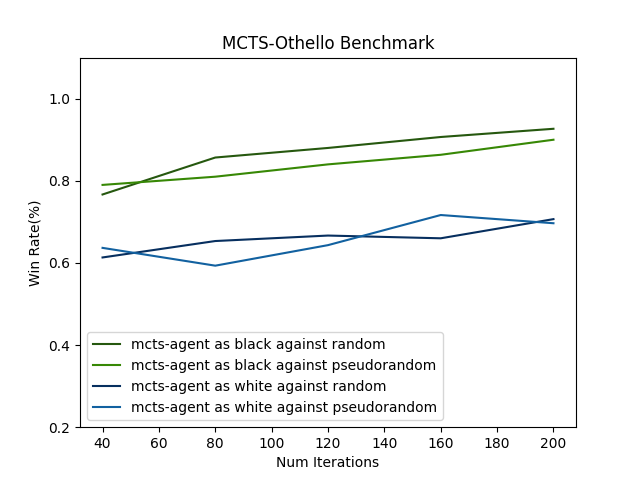

# OthelloMCTS

## Introduction
This is a final project for STAT 37789 Topics in Machine Learning : Learning in Games
(Instructor: Alexander Strang, University of Chicago)

Contributors: Eddie Yu, Kevin Kim

## Project
We implement Othello Game-Playing AI, using MCTS algorithm.

## Result

1. Game of Othello is advantageous to the player who plays black. (Normally the convention is that Black always goes first in Othello, and the less experienced player should take this color.)
2. `Pseudorandom Player` is heuristically coded so that it chooses moves with higher probability to those in the sides of the board. When number of iterations are small, pseudorandom player indeed plays better than random player who randomly chooses moves. This can be shown from the fact that it is harder for MCTS agent to win against Pseudorandom player than Random Plyaer when `num_iterations` is smaller than 100.